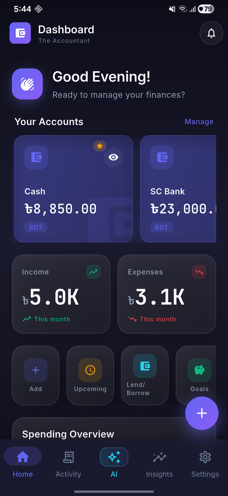
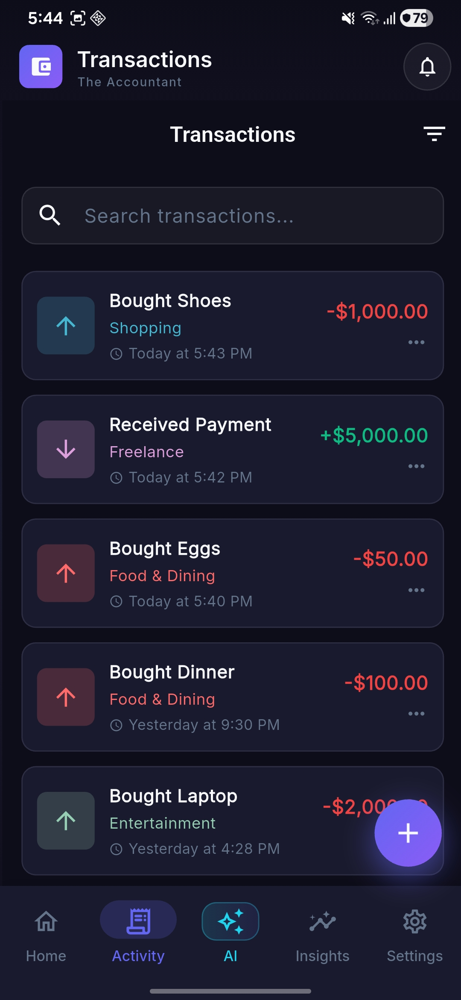
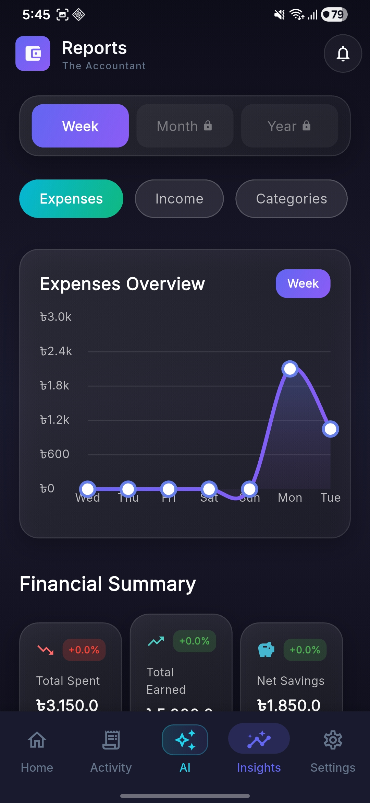
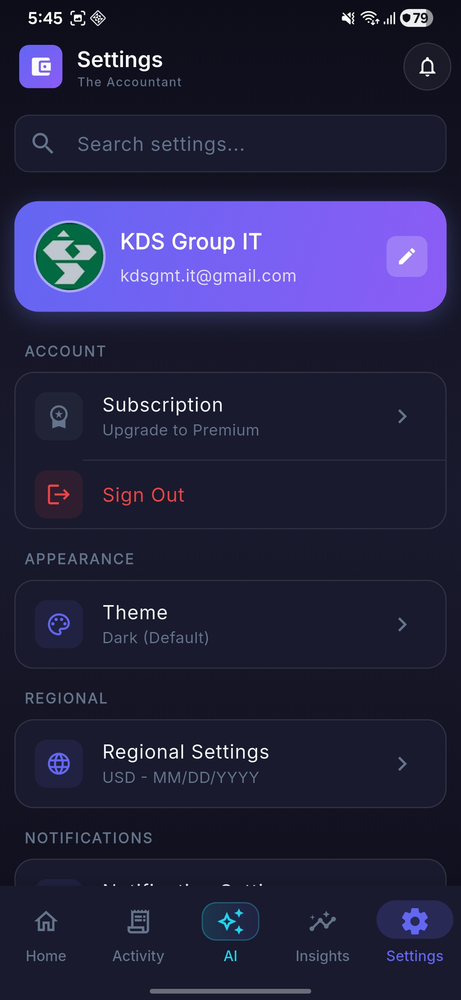
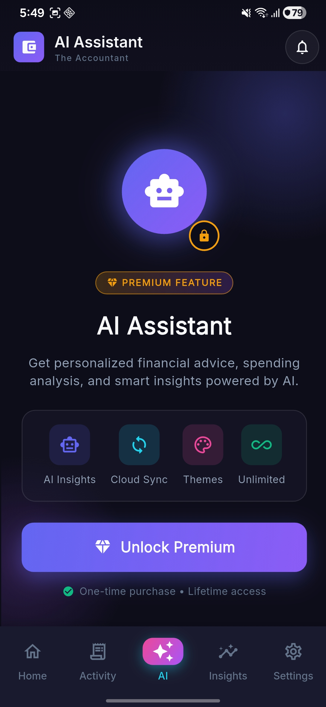
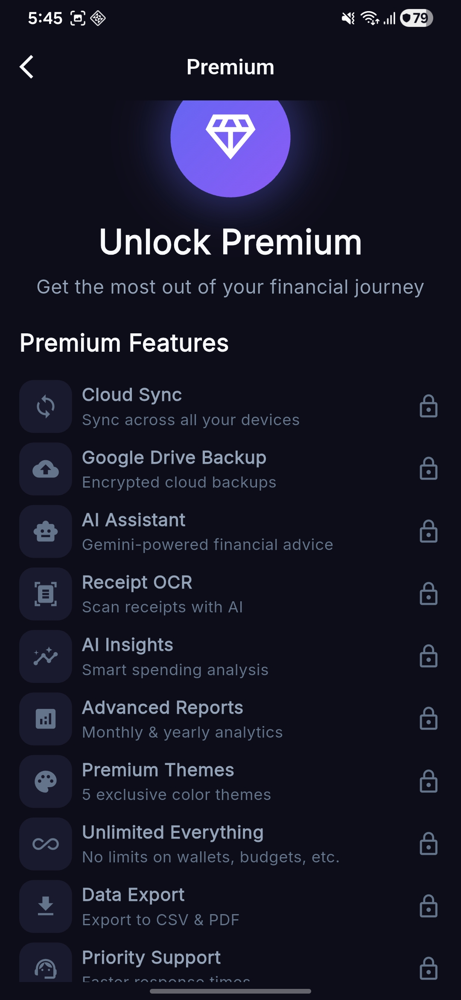
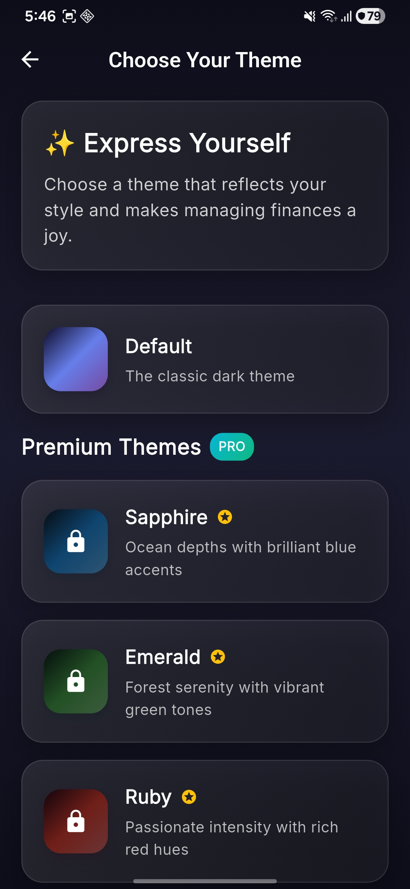
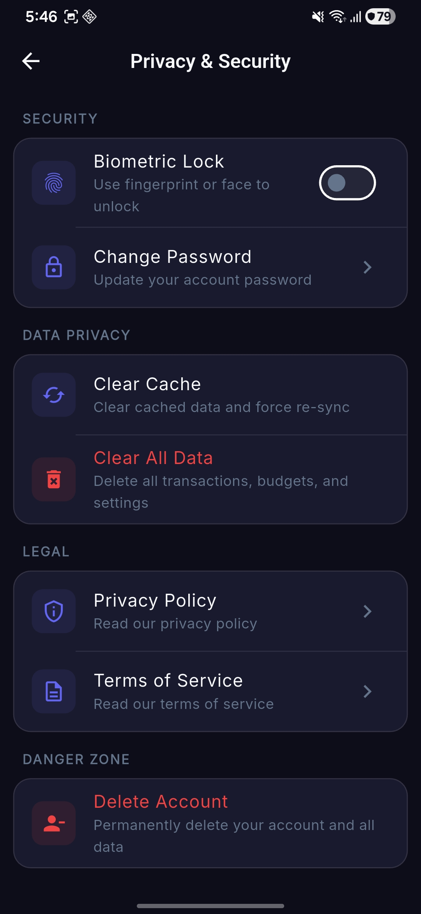
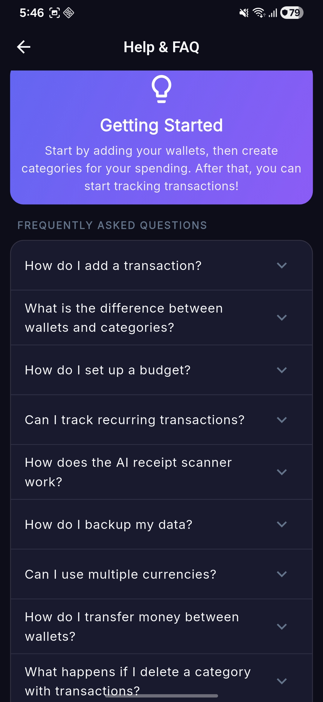

# The Accountant

A modern, privacy-focused personal finance management app built with Flutter. Features a beautiful dark theme UI, local-first data storage, and optional cloud sync.

## Screenshots

<p align="center">
  
  
  
  
</p>

<p align="center">
  
  
  
  
</p>

<p align="center">
  
</p>

## Features

### Core Features
- **Transaction Management** - Track income and expenses with categories, notes, and payment methods
- **Multi-Wallet Support** - Manage multiple accounts (personal, savings, business, etc.)
- **Multi-Currency** - Support for 40+ currencies with exchange rate conversion
- **Budget Tracking** - Set weekly/monthly budgets with progress notifications
- **Recurring Transactions** - Automate regular income and expenses
- **Credit & Debt Tracking** - Keep track of money you owe or are owed
- **Financial Reports** - Comprehensive analytics with interactive charts

### Premium Features
- **AI-Powered Receipt Scanning** - Extract transaction details from receipts using OCR
- **Smart Insights** - AI-generated spending analysis and recommendations
- **Financial Chat Assistant** - Ask questions about your finances

### Design
- **Dark Theme** - Modern glassmorphic design with neon accents
- **Smooth Animations** - Staggered animations and micro-interactions
- **Responsive Layout** - Optimized for all screen sizes

### Privacy & Security
- **Local-First Storage** - All data stored locally using Drift (SQLite)
- **Secure Authentication** - Firebase Auth with Google Sign-In support
- **Optional Cloud Sync** - Sync across devices only if you choose to

## Tech Stack

- **Framework**: Flutter 3.x
- **State Management**: Riverpod
- **Local Database**: Drift (SQLite)
- **Authentication**: Firebase Auth
- **Charts**: fl_chart
- **AI Features**: Google ML Kit (OCR), Gemini API

## Getting Started

### Prerequisites
- Flutter SDK 3.0+
- Dart SDK 3.0+
- Android Studio / VS Code
- Firebase project (for authentication)

### Installation

1. Clone the repository
```bash
git clone https://github.com/yourusername/the_accountant.git
cd the_accountant
```

2. Install dependencies
```bash
flutter pub get
```

3. Set up environment variables
```bash
cp .env.example .env
# Edit .env with your configuration
```

4. Run code generation
```bash
dart run build_runner build --delete-conflicting-outputs
```

5. Run the app
```bash
flutter run
```

## Project Structure

```
lib/
├── app/                     # App configuration and routing
├── core/                    # Core utilities and services
│   ├── constants/          # App constants
│   ├── providers/          # Global providers
│   ├── services/           # Core services (API, auth, etc.)
│   ├── themes/             # App theming (colors, typography, spacing)
│   └── utils/              # Utility functions
├── data/                   # Data layer
│   ├── datasources/        # Local database (Drift)
│   ├── models/             # Data models (Drift tables)
│   └── repositories/       # Data repositories
├── features/               # Feature modules
│   ├── authentication/     # Login, signup, account linking
│   ├── dashboard/          # Home screen and overview
│   ├── transactions/       # Transaction management
│   ├── wallets/            # Wallet/account management
│   ├── budgets/            # Budget tracking
│   ├── categories/         # Category management
│   ├── credit_debt/        # Credit and debt tracking
│   ├── objectives/         # Savings goals
│   ├── reports/            # Financial reports and analytics
│   ├── onboarding/         # First-time user setup
│   └── settings/           # App settings
└── shared/                 # Shared components
    ├── models/
    ├── services/
    └── widgets/            # Reusable UI components
```

## Development

### Code Generation
After modifying Riverpod providers or Drift models:
```bash
dart run build_runner build --delete-conflicting-outputs
```

For continuous generation during development:
```bash
dart run build_runner watch --delete-conflicting-outputs
```

### Code Quality
```bash
# Analyze code
flutter analyze

# Format code
dart format lib/
```

### Running Tests
```bash
flutter test
```

### Building for Production

**Android:**
```bash
flutter build apk --release
# or for Play Store
flutter build appbundle --release
```

**iOS:**
```bash
flutter build ios --release
```

**Windows:**
```bash
flutter build windows --release
```

## Configuration

The app uses environment variables for configuration. See `.env.example` for required variables:

- `API_BASE_URL_DEV` - Development backend URL
- `API_BASE_URL_PROD` - Production backend URL
- `GEMINI_API_KEY` - Google Gemini API key (for AI features)

## Backend

This app connects to a FastAPI backend for cloud sync and authentication. See the [backend repository](../the_accountant_backend) for setup instructions.

## License

This project is proprietary software. All rights reserved.

## Support

For issues and feature requests, please use the GitHub issue tracker.
